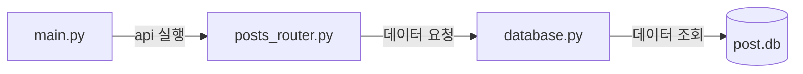

# fastapi-server

## 아키텍처


## 버전 목록
- python : 3.12.0

## 사용 예시
### 게시글 목록 조회 API
```
curl -X 'GET'
    'http://127.0.0.1:8000/api/posts/'
    -H 'accept: application/json'
```
### 게시글 생성 API
```
curl -X 'POST'
    'http://127.0.0.1:8000/api/posts/'
    -H 'accept: application/json'
    -H 'Content-Type: application/json'
    -d '{
        "author": "string",
        "title": "string",
        "content": "string"
        }'
```
### 게시글 조회 API
```
curl -X 'GET'
    'http://127.0.0.1:8000/api/posts/1'
    -H 'accept: application/json'
```
### 게시글 수정 API
```
curl -X 'PUT'
    'http://127.0.0.1:8000/api/posts/1'
    -H 'accept: application/json'
    -H 'Content-Type: application/json'
    -d '{
        "author": "string",
        "title": "string",
        "content": "string"
        }'
```
### 게시글 삭제 API
```
curl -X 'DELETE'
    'http://127.0.0.1:8000/api/posts/1'
    -H 'accept: application/json'
```

## 환경 설정 방법
### 1. pyenv 설치 방법
```brew install pyenv```

### 2. pyenv로 파이썬 버전 설치
```pyenv install 3.12.0```

### 3. pyenv 실행
```pyenv shell 3.12.0```

### 4. poetry 설치 방법
```curl -sSL https://install.python-poetry.org | python3 -```

### 5. poetry 가상환경 실행
```poetry shell```

### 6. poetry로 필요한 패키지 일괄 설치
```poetry install```

### 7. poetry 종료 방법
```exit```

## fastAPI 서버 실행 및 종료 방법

### 1. 실행 방법
```uvicorn main:app --reload```

### 2. 종료 방법
```ctrl + c```
